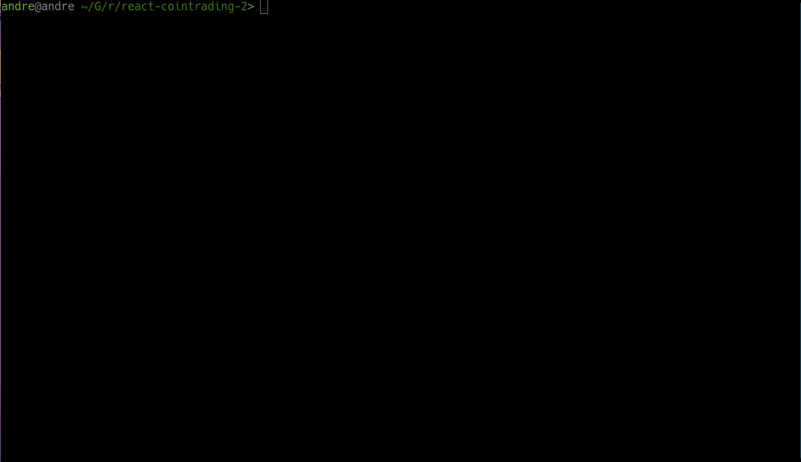

# package-scripts



Utility code for listing and running code from `package.json` files.

# Usage

```shell
cd <node-project-directory>
package-scripts
```

## Command-line arguments

### Interactive mode

```shell
package-scripts
```

Runs the default flow, showing a list of commands where one can be picked to be executed.

### Clipboard mode
```shell
package-scripts -c
package-scripts --clipboard
```

Runs the same as the interactive mode, but after choosing a command, instead of running it, the command is copied to the clipboard.

### List mode

```shell
package-scripts -l
package-scripts --list
```

Prints the formatted list of commands, without the option to choose one to run.

### Raw mode

```shell
package-scripts -r
package-scripts --raw
```

Prints a `json` list where every element is itself a list of two items, the first is the command issued by the user (starting within `yarn` or `npm`) and the second is the script executed for that alias.

## Configuration files

### `emojist.json`

Contains key-value entries where the key is the text that must be present on the `yarn/node` alias and the value is the emoji to print for that kind of command.

The order in the `.json` is kept for testing the commands, so, a command `start:build` will be printed with the `build` emoji if it's before the `start` emoji on `emojist.json`.


## `config.json`

Generic configuration values. 

```js
{
    "packageManager": "yarn", // The name of the package manager
    "runCommand": "" // The command used to run the aliases on `package.json`
}
```

If you want to use `npm run` instead of `yarn`, you can use:

```js
{
    "packageManager": "npm", // The name of the package manager
    "runCommand": "run" // The command used to run the aliases on `package.json`
}
```
